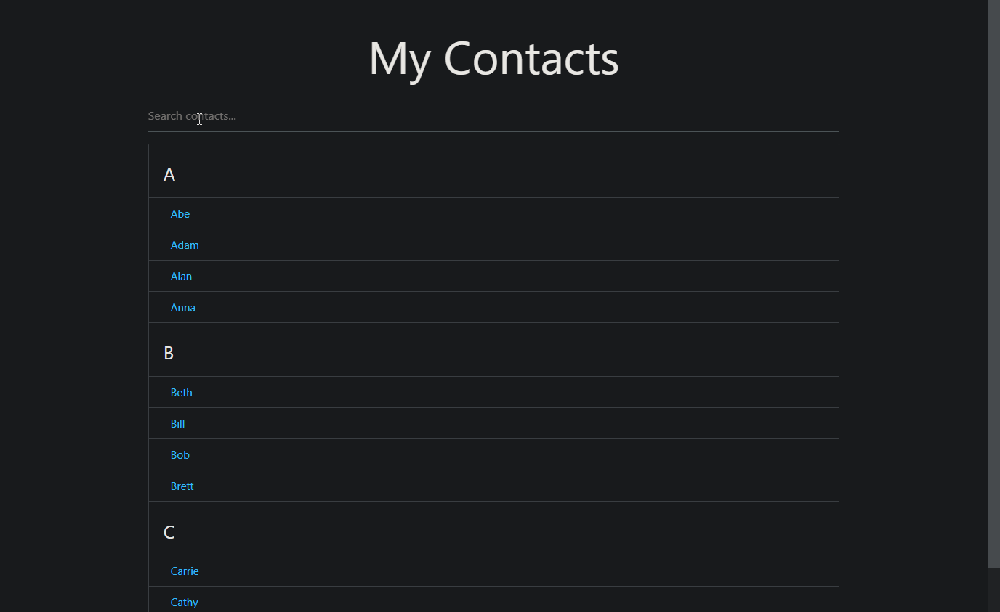

# **JavaScript BookList App**
> [Youtube Walkthrough](https://www.youtube.com/watch?v=G1eW3Oi6uoc&list=WL&index=2&t=77s)

## **Description**
Build a filterable list using HTML, CSS, and JavaScript. Stylized with minimal use of Materialize CSS. 

Web Technologies
- HTML5, and JavaScript

Connections
- [Materialize CSS](https://materializecss.com/)

## **Project Demo**
