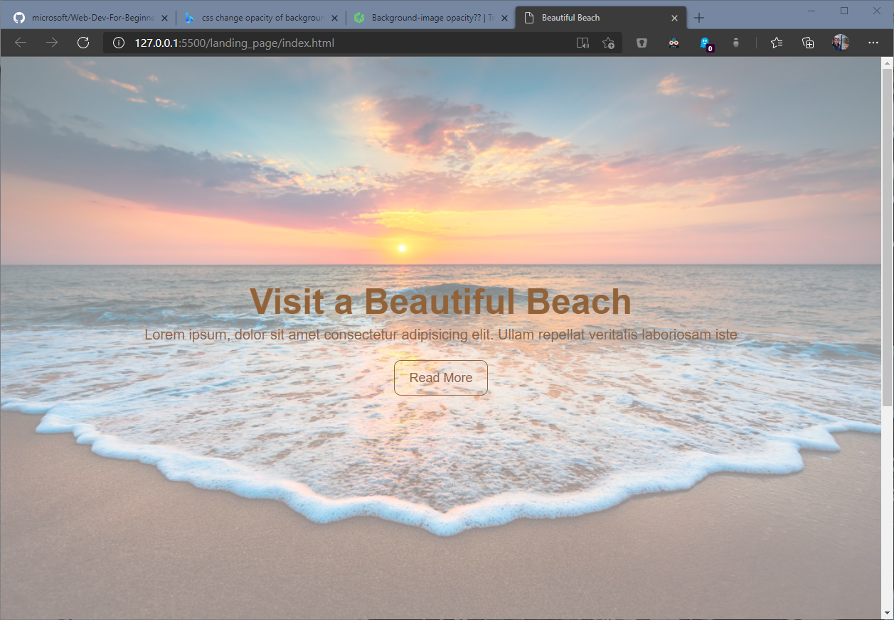

# **Easy Fullscreen landing Page With HTML & CSS**
> [Youtube Walkthrough](https://www.youtube.com/watch?v=hVdTQWASliE)

## **Description**
Demonstration of a website landing page with a fullscreen image that scales with window resizing using HTML and CSS. Additionally use flexbox for some minimal page styling. 

## **Searched Project Queries**
- Change background image opacity without affecting overlaid text: [team tree house](https://teamtreehouse.com/community/backgroundimage-opacity#:~:text=There%20is%20no%20css%20property%20for%20changing%20the,alot%20of%20different%20ways%20but%20here%27s%20two%20approaches%3A)

## **Project Demo**
