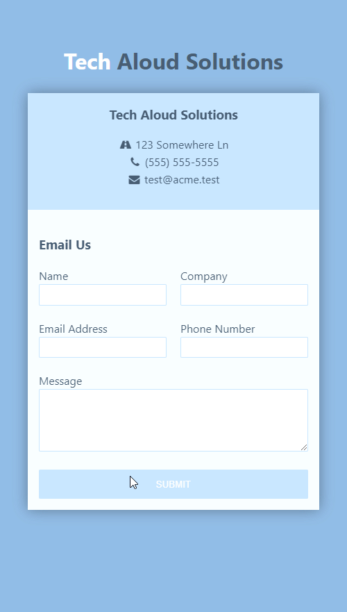

# **Mobile First Responsive Contact Form Featuring Grid CSS**
> [Youtube Walkthrough](https://www.youtube.com/watch?v=Sb5qOa3R4hY&list=WL&index=3)

## **Description**
Demonstrative mobile first responsive design for a web form using HTML and CSS. Site uses CSS grid to structure the elements. Additionally uses font awesome for icons and animate.css to create a entry animation. 

Currently only implements front-end UI. 

## **Project Demo**
