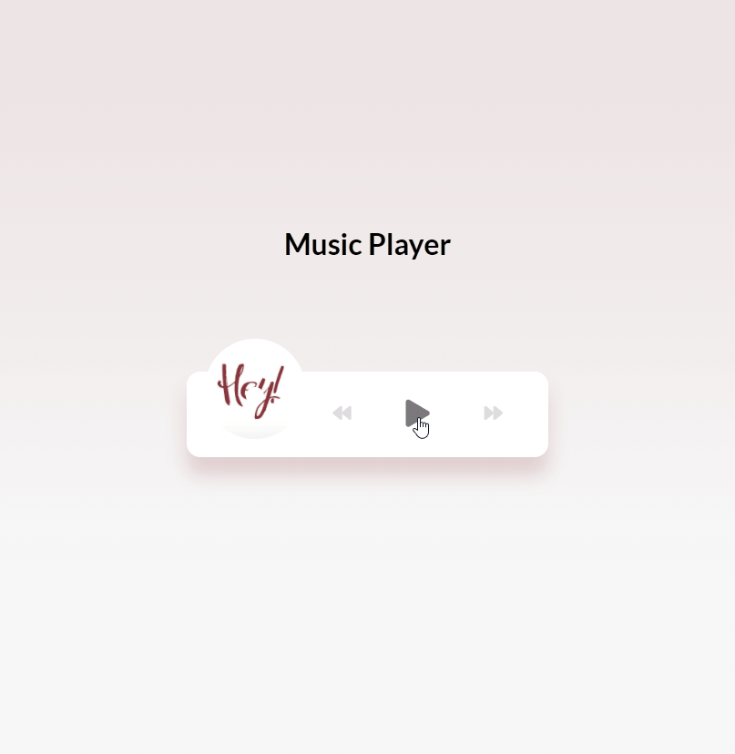

# **Music Player**
> [Youtube Walkthrough](https://www.youtube.com/watch?v=QTHRWGn_sJw&list=WL&index=2&t=111s)

## **Description**
Create a music player with HTML, CSS, and vanilla JavaScript and the HTML5 audio API.

Web Technologies
- HTML5, CSS, and JavaScript
- MTL5 audio API

Connections
[Font Awesome Icons](https://fontawesome.com/)

## **Project Demo**

