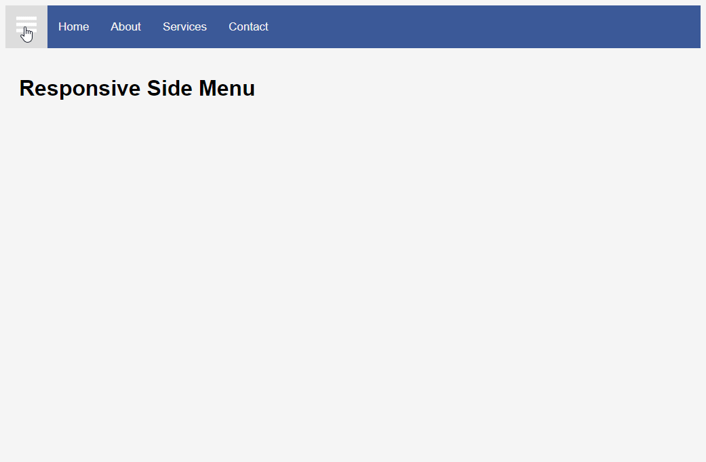

# **Responsive HTML & CSS Side Menu**
> [Youtube Walkthrough](https://www.youtube.com/watch?v=wpGNFGqNfdU&list=WL&index=3&t=1175s)

## **Description**
Demonstration website implementing a responsive side menu using HTML, CSS, and 'plain' JavaScript (no 3rd party frameworks or libraries used). JavaScript included in `index.html` file with a script tag at the end of the html body tag. 

## **Project Demo**
