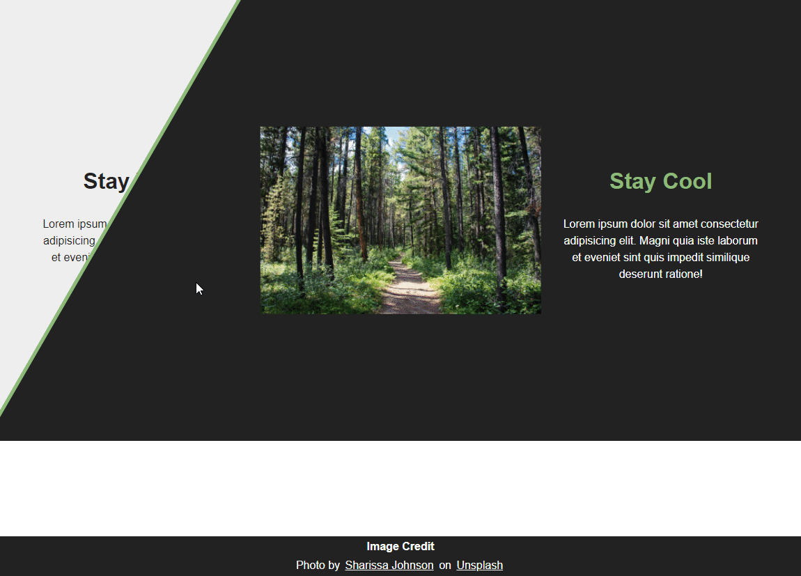

# **Split Screen Slider HTML, CSS, & JS**
> [Youtube Walkthrough](https://www.youtube.com/watch?v=5F0EvajMlXo&list=WL&index=10)

## **Description**
Demonstration implementing a screen image slider using HTML, CSS, and JS. End result is a dynamic revealed of two different photos based on mouse cursor position.

## **Project Demo**
